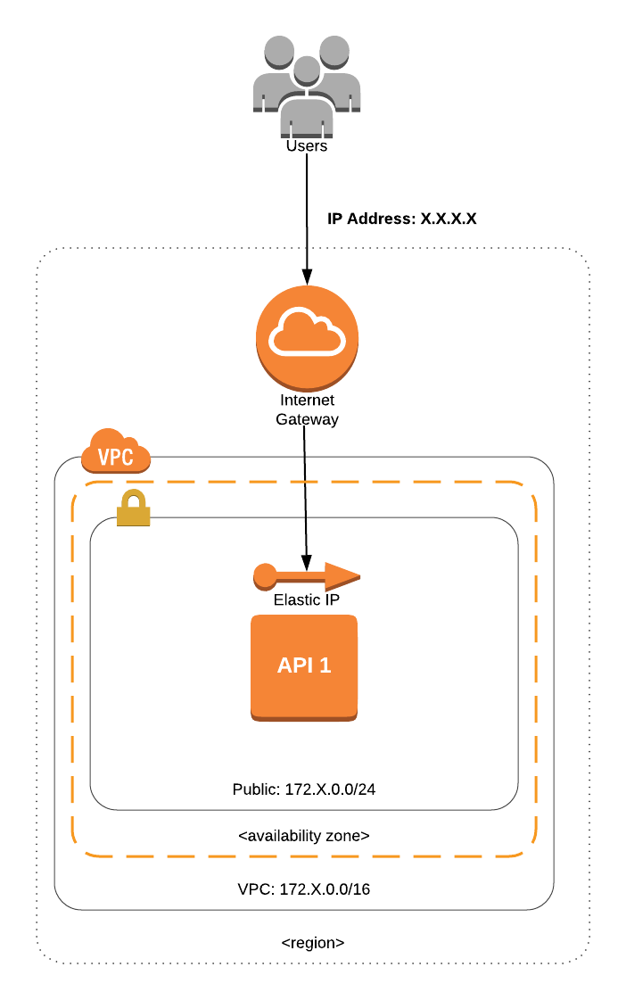
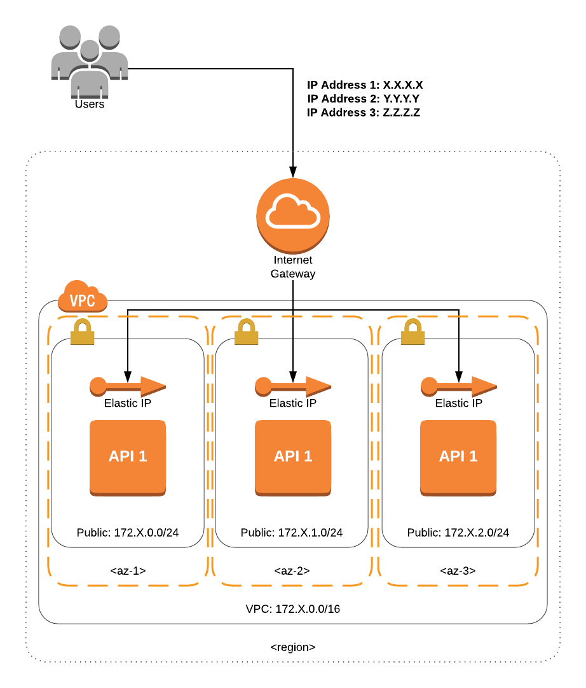
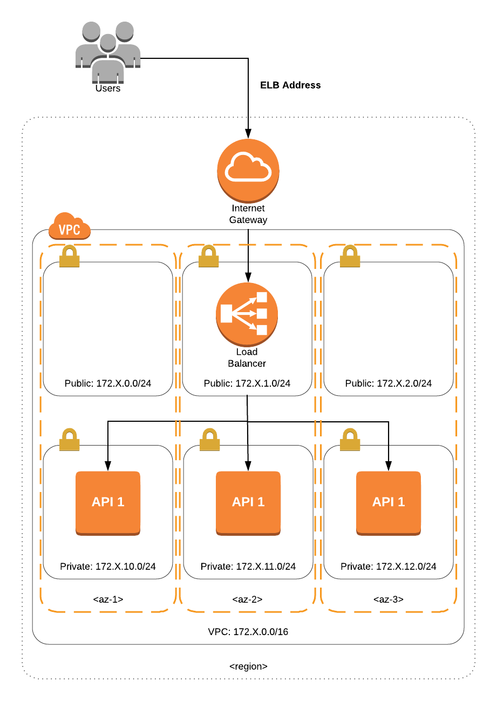
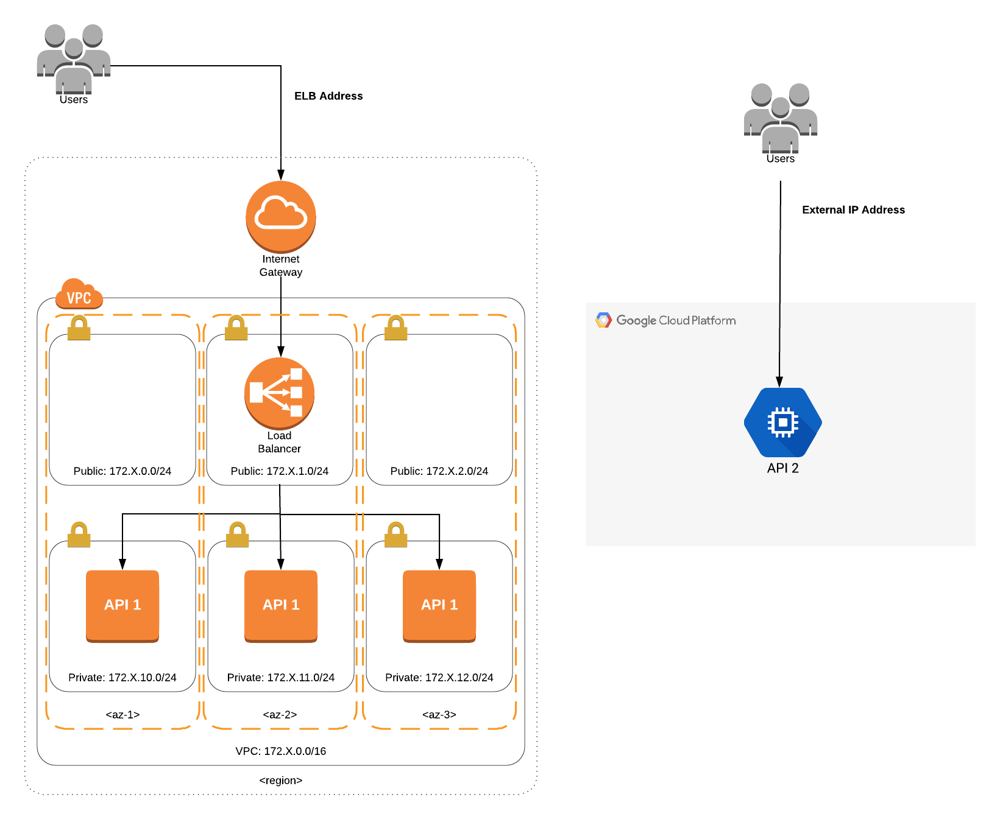
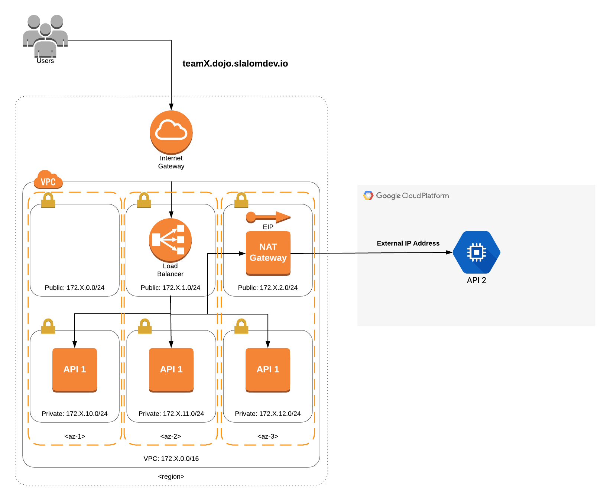

# Challenge
In this Terraform challenge, you will have to deploy a few infrastructure components to two different Cloud providers: [Amazon Web Services](https://aws.amazon.com/) and [Google Cloud Platform](https://cloud.google.com/). You do not need to be an expert in any of these platforms as the focus is to learn Terraform. However, any experience in any of these platforms will certainly be helpful.

In order to help you build the final solution, this challenge will have different stages. The more stages you go through, the more complex your infrastructure will become and the closer you will be to the final solution.

For this challenge, we will be using [Terraform](https://www.terraform.io/docs/index.html) **0.11.7**.

# FAQ

## I did not attend the Dojo. How can I take this challenge?

To take this challenge, you will have to provision the same base infrastructure Slalom provided the attendees during the event. Follow the tutorial in the `run-your-own-dojo` folder to provision your own base infrastructure before proceeding.

## I heard that Terraform 0.12 is coming out soon. Will we use it?

If you have been working with Terraform for a while, you might have heard that Hashicorp is planning a big release with Terraform 0.12. We will not use 0.12 in this Dojo for a couple of reasons:

* The only way to use 0.12 at the moment is to compile from source. In order to guarantee the quality of the event, we will use a stable version.
* Although quite a few syntax changes will be introduced, we highly recommend you learn the "old" syntax as that's the syntax you will find in all Terraform codebases at the moment.
* The overall syntax will remain the same, so we can guarantee you will learn Terraform regardless of the version.

# WSL + Docker for Windows

If you have the Windows Subsystem for Linux (Bash for Windows) installed and would like to use it with Docker, [follow these instructions](https://nickjanetakis.com/blog/setting-up-docker-for-windows-and-wsl-to-work-flawlessly).

# Getting started

You will not need to install Terraform, the AWS CLI or the Google Cloud SDK locally. You will be provided with a Docker image which already contains all the tools needed.

To get started, create a directory anywhere in your system where you will store all the Terraform template files (NB: if you are using Windows 7, make sure you create this directory inside your user's directory as in the last Dojo we had an issue when trying to mount a non-user directory into a Docker container).

Now, issue the following Docker command:

```
docker run --rm -it -e "URL1=<URL1>" -e "URL2=<URL2>" -v <ANY-LOCAL-DIRECTORY-FULL-PATH>:/code slalomdojo/env
```

The command above will spin up a container using the *slalomdojo/env* image and the directory you created locally in your computer will be mounted into the container at the path **/code**, which means you can use your favourite Text Editor/IDE to code locally (all changes will be propagated to the container automatically). Finally, you will notice that you need to specify two environment variables: **URL1** and **URL2**. You will be given further instructions at the beginning of the challenge.

**PS: If you are trying to run your own Dojo, please follow the instructions in the `run-your-own-dojo` folder before proceeding to Stage 0.**

# Stage 0

This stage will get you familiar enough with Terraform so you can start building the solution in the next stages. **However, if you are already experienced in using Terraform, you can skip to Stage 1**. 

First, open the workspace you created in the **Getting Started** section and create a file called **main.tf** with the following content:

main.tf
```
provider "aws" {
  region = "<AWS_REGION>"
}

resource "aws_eip" "eip" {
  vpc = true
}
```

PS: Take a look at the piece of paper you've been given to know which region to use.

Terraform template files have *.tf* extension. That's where you will define all the resources your infrastructure will have. 
The provider block you defined in main.tf will tell Terraform which plugins to download. In this case, Terraform will download the AWS plugin so it can make calls to the AWS API (Terraform does not use the AWS CLI to make API calls, it actually uses the [AWS Golang SDK](https://github.com/terraform-providers/terraform-provider-aws/tree/master/aws)).
The resource block (with syntax: *resource "RESOURCE_TYPE" "RESOURCE_NAME" {}*), on the other hand, is used to declare infrastructure resources. In this case, you will be creating an Elastic IP as an example.

Once you finish main.tf, the first command you will run is *terraform init*:

```
$ terraform init

Initializing provider plugins...
- Checking for available provider plugins on https://releases.hashicorp.com...
- Downloading plugin for provider "aws" (1.28.0)...

The following providers do not have any version constraints in configuration,
so the latest version was installed.

To prevent automatic upgrades to new major versions that may contain breaking
changes, it is recommended to add version = "..." constraints to the
corresponding provider blocks in configuration, with the constraint strings
suggested below.

* provider.aws: version = "~> 1.28"

Terraform has been successfully initialized!

You may now begin working with Terraform. Try running "terraform plan" to see
any changes that are required for your infrastructure. All Terraform commands
should now work.

If you ever set or change modules or backend configuration for Terraform,
rerun this command to reinitialize your working directory. If you forget, other
commands will detect it and remind you to do so if necessary.
```

What *terraform init* does is to create a directory called *.terraform* and download the AWS plugin. That means if you declare other providers, like GCP, *terraform init* will also download the GCP plugin.

You will also need to rerun *terraform init* whenever you:

* Declare a provider
* Declare a module
* Configure a remote backend

Next, let's see how we can perform a dry run. Run the following command:

```
$ terraform plan
Refreshing Terraform state in-memory prior to plan...
The refreshed state will be used to calculate this plan, but will not be
persisted to local or remote state storage.


------------------------------------------------------------------------

An execution plan has been generated and is shown below.
Resource actions are indicated with the following symbols:
  + create

Terraform will perform the following actions:

  + aws_eip.eip
      id:                <computed>
      allocation_id:     <computed>
      association_id:    <computed>
      domain:            <computed>
      instance:          <computed>
      network_interface: <computed>
      private_ip:        <computed>
      public_ip:         <computed>
      vpc:               "true"


Plan: 1 to add, 0 to change, 0 to destroy.

------------------------------------------------------------------------

Note: You didn't specify an "-out" parameter to save this plan, so Terraform
can't guarantee that exactly these actions will be performed if
"terraform apply" is subsequently run.
```

The goal of Terraform plan is to tell you what will be created, modified or deleted. That's just so you are aware what will happen with your infrastructure before you go ahead and apply the changes.

Once you're happy with plan's output, run:

```
$ terraform apply

An execution plan has been generated and is shown below.
Resource actions are indicated with the following symbols:
  + create

Terraform will perform the following actions:

  + aws_eip.eip
      id:                <computed>
      allocation_id:     <computed>
      association_id:    <computed>
      domain:            <computed>
      instance:          <computed>
      network_interface: <computed>
      private_ip:        <computed>
      public_ip:         <computed>
      vpc:               "true"


Plan: 1 to add, 0 to change, 0 to destroy.

Do you want to perform these actions?
  Terraform will perform the actions described above.
  Only 'yes' will be accepted to approve.

  Enter a value: yes

aws_eip.eip: Creating...
  allocation_id:     "" => "<computed>"
  association_id:    "" => "<computed>"
  domain:            "" => "<computed>"
  instance:          "" => "<computed>"
  network_interface: "" => "<computed>"
  private_ip:        "" => "<computed>"
  public_ip:         "" => "<computed>"
  vpc:               "" => "true"
aws_eip.eip: Creation complete after 0s (ID: eipalloc-a660a5ad)

Apply complete! Resources: 1 added, 0 changed, 0 destroyed.
```

After you ran apply, Terraform created a file called *terraform.tfstate*. A [state file](https://www.terraform.io/docs/state/) contains state information about your managed infrastructure and configuration. If you cat terraform.tfstate, you will see the following:

```
{
    "version": 3,
    "terraform_version": "0.11.7",
    "serial": 3,
    "lineage": "3937a9a2-af3f-ddeb-bce4-27ab7d5418af",
    "modules": [
        {
            "path": [
                "root"
            ],
            "outputs": {},
            "resources": {
                "aws_eip.eip": {
                    "type": "aws_eip",
                    "depends_on": [],
                    "primary": {
                        "id": "eipalloc-a660a5ad",
                        "attributes": {
                            "association_id": "",
                            "domain": "vpc",
                            "id": "eipalloc-a660a5ad",
                            "instance": "",
                            "network_interface": "",
                            "private_ip": "",
                            "public_ip": "18.211.34.236",
                            "tags.%": "0",
                            "vpc": "true"
                        },
                        "meta": {
                            "e2bfb730-ecaa-11e6-8f88-34363bc7c4c0": {
                                "delete": 180000000000,
                                "read": 900000000000,
                                "update": 300000000000
                            }
                        },
                        "tainted": false
                    },
                    "deposed": [],
                    "provider": "provider.aws"
                }
            },
            "depends_on": []
        }
    ]
}
```

The state file keeps track of things like the Terraform version, the resources created, resource dependencies etc. When working in a bigger project, you do not want to store the state file locally. The best approach is to save this file in a remote storage (like S3). You will see how this is done as you progress in the challenge.

Let's destroy the infrastructure created:

```
$ terraform destroy
aws_eip.eip: Refreshing state... (ID: eipalloc-a660a5ad)

An execution plan has been generated and is shown below.
Resource actions are indicated with the following symbols:
  - destroy

Terraform will perform the following actions:

  - aws_eip.eip


Plan: 0 to add, 0 to change, 1 to destroy.

Do you really want to destroy?
  Terraform will destroy all your managed infrastructure, as shown above.
  There is no undo. Only 'yes' will be accepted to confirm.

  Enter a value: yes

aws_eip.eip: Destroying... (ID: eipalloc-a660a5ad)
aws_eip.eip: Destruction complete after 0s

Destroy complete! Resources: 1 destroyed.
```

Now you're ready to begin the challenge. **Keep the provider block, but remove the EIP resource block from main.tf before proceeding**.

# Stage 1

## Architecture


In the first stage, you will launch a very basic network on AWS composed of one VPC and one public subnet. This is obviously far from a secure and scalable solution, but this is just the first step. Use the following information for the AWS resources you will need to define in your Terraform template files:

* Region: You will receive instructions as to which region you should deploy your solution
* Network
  * VPC
    * VPC CIDR Block: 172.**X**.0.0/16. X = (team number) + 15. Examples: Team 1 (1 + 15 = 16), Team 2 (2 + 15 = 17) etc.
    * Enable DNS Support
    * Enable DNS Hostnames
    * Set the tenancy to "default"
  * Public Subnet CIDR Block: 172.**X**.0.0/24
* EC2
  * Instance size: t2.nano (you will not be able to launch an instance bigger than t2.nano)
  * AMI ID: You will receive instructions as to which AMI ID to use for API 1
  * Security Group
    * Inbound: ALLOW TCP traffic in on port 3000 from ANY source
    * Outbound: ALLOW TCP traffic out on ANY port to ANY destination
* Use tags to name your resources and to identify your team as owner of the resource. For example, within each Terraform resource, declare a tags block (if the resource supports tags) with Name and Team keys:

```
resource "aws_resource" "resource" {
    ...

    tags {
        Name = "Name of the resource"
        Team = "Team X"
    }
}
```

To help you identify all AWS resources you will need to complete Stage 1, take a look at the list below:

* [VPC](https://www.terraform.io/docs/providers/aws/r/vpc.html)
* [Internet Gateway](https://www.terraform.io/docs/providers/aws/r/internet_gateway.html)
* [Subnet](https://www.terraform.io/docs/providers/aws/r/subnet.html)
* [Route](https://www.terraform.io/docs/providers/aws/r/route.html)
* [Route Table](https://www.terraform.io/docs/providers/aws/r/route_table.html)
* [Route Table Association](https://www.terraform.io/docs/providers/aws/r/route_table_association.html)
* [EC2 Instance](https://www.terraform.io/docs/providers/aws/r/instance.html)
* [Security Group](https://www.terraform.io/docs/providers/aws/r/security_group.html)
* [Elastic IP](https://www.terraform.io/docs/providers/aws/r/eip.html)

PS: You do not necessarily need to create NACLs for this VPC, but feel free to do so if you would like.

If you are still in doubt how to organize all these resources in order to create the Stage 1 infrastructure, please reach out to one of the organizers.

## Output

Since you will not have access to the AWS Console, there needs to be a way for you to find out the IP address of your instance. Use [Output Variables](https://www.terraform.io/intro/getting-started/outputs.html) for that.

## DoD (Definition of Done)

You will have completed the first Stage if you go to your web browser, type in the IP Address of the API 1 instance (port 3000) and get the following message back: `API 1 is running fine. But I was not able to reach API 2 due to <ERROR>`. This means you have successfully deployed API 1 but API 1 still can't reach API 2, which is totally fine at this point.

# Stage 2

## Remote Backend

Before starting Stage 2, let's take a look at how we can use and why should we use remote backend. As already mentioned, whenever you provision infrastructure, Terraform keeps track of resources using a state file. So far, this file has been stored on your local machine, which is not ideal especially if there are more people in the team. A [Remote Backend](https://www.terraform.io/intro/getting-started/remote.html) is a remote storage solution used to store the state file. For more information on which types of backend can be used, [click here](https://www.terraform.io/docs/backends/types/index.html).

For this challenge, we'll use S3 as a remote backend. Create a file called **backend.tf** with the following content:

backend.tf
```
terraform {
  backend "s3" {
    bucket = "<TEAM_NAME>-tf-state"
    key    = "state"
    region = "us-east-1"
  }
}
```

The bucket specified in the *bucket* key has already been created for you. The *key* is just the name of the state file on S3 (it can be any name). Use **us-east-1** as region.

Now that you have a remote backend configured, let's run *terraform init* again so Terraform can initialize the backend. If you are wondering what's going to happen with the current state file, Terraform will ask you whether you want to copy the current state file to S3. Answer **yes**:

```
$ terraform init

...

Initializing the backend...
Pre-existing state was found while migrating the previous "local" backend to the
  newly configured "s3" backend. An existing non-empty state already exists in
  the new backend. The two states have been saved to temporary files that will be
  removed after responding to this query.

  Previous (type "local"): /tmp/terraform124106212/1-local.tfstate
  New      (type "s3"): /tmp/terraform124106212/2-s3.tfstate

  Do you want to overwrite the state in the new backend with the previous state?
  Enter "yes" to copy and "no" to start with the existing state in the newly
  configured "s3" backend.

  Enter a value: yes


Successfully configured the backend "s3"! Terraform will automatically
use this backend unless the backend configuration changes.

...
```

Now whenever you create or modify resources, Terraform will modify the state file on S3.

## Architecture


In Stage 2, instead of having one public subnet and one API 1 instance, your team will have to deploy three public subnets and three API 1 instances (one per subnet).

There are two main ways to achieve this. You can either declare three subnets, three instance and three elastic IPs separately:

```
resource "aws_subnet" "public_subnet_1" {

}

resource "aws_subnet" "public_subnet_2" {

}

resource "aws_subnet" "public_subnet_3" {

}

resource "aws_instance" "api1_1" {

}

resource "aws_instance" "api1_2" {

}

resource "aws_instance" "api1_3" {

}

resource "aws_eip" "eip_1" {
  instance = "${aws_instance.api1_1.id}"
  vpc      = true
}

resource "aws_eip" "eip_2" {
  instance = "${aws_instance.api1_2.id}"
  vpc      = true
}

resource "aws_eip" "eip_3" {
  instance = "${aws_instance.api1_3.id}"
  vpc      = true
}
```

Or, you can leverage [Terraform's Count Parameter](https://www.terraform.io/intro/examples/count.html) (there's a code example link in the website).

## DoD (Definition of Done)

The Definition of Done of Stage 2 is the same as Stage 1, but you will have to test three IP Addresses instead of just one.

# Stage 3

## Architecture


Now things will start to get a bit more complicated. Since keeping API servers in public subnets is far from being a best practice, you will move them to private subnets. In AWS, a subnet is considered private when there is no route to the Internet that go through the Internet Gateway.  
If you are an experienced AWS architect, you probably thought about deploying an NAT Gateway so the API servers in the private subnets can reach the Internet. However, we will not introduce NAT Gateways just yet since the API does not need Internet access. Instead, you will deploy a Load Balancer (LB) so clients can reach the API.

In AWS, there are three kinds of Load Balancers: Classic, HTTP and Network. For this challenge, you will be launching the Classic Load Balancer. Here's some useful information:

* Listener: traffic should come on port 80 of the Load Balancer and be directed to port 3000 of the EC2 instances
* Health Check: use the endpoint **/health** and HTTP on port 3000 to check the status of the instance. The rest of the configuration is in your hands
* Security Group
  * Inbound: traffic from ANY source should be allowed in on port 80
  * Outbound: traffic should be allowed out on ANY port to ANY destination

If you take a look at the EC2 instance security group, you will see that the source of the traffic is **0.0.0.0/0**. You can limit that to only allow traffic from the Load Balancer since the API 1 has been moved to private subnets.

You will also notice that there are three Load Balancer symbols in the diagram. You will not have to launch three LBs, you will just have to make sure your Load Balancer expands across the three public subnets.

## DoD (Definition of Done)

Same as Stage 1. Use the Elastic Load Balancer address instead of IP addresses (if you get a `Could not resolve host` error, wait a few minutes until the Load Balancer DNS name propagates).

# Stage 4

## Architecture


Stage 4 introduces GCP to the solution. You will need to launch only two resources: a [Virtual Machine](https://www.terraform.io/docs/providers/google/r/compute_instance.html) and an [external address](https://www.terraform.io/docs/providers/google/r/compute_address.html). Take a look at the technical requirements below:

* Use **f1-micro** for the Machine Type.
* Since all teams will be deploying resources to the same account, you will need to choose an unique name for your resources. Suggestion: for the API server, call it <TEAM_NAME>-api2 (e.g., team1 would be **team1-api2**, team2 would be **team2-api2** etc).
* The name of the **network** should be *default*. 
* When declaring the compute instance, you will need to assign an array with the string "dojo" to the *tags* key (this is just so your instance can receive traffic from the Internet)
* The name of the Virtual Machine Image is **projects/terraform-dojo/global/images/devops-dojo**
* To attach the external IP to the virtual machine, have a look at the **access_config** configuration block (this should be defined inside the Virtual Machine resource block).
* Deploy the virtual machine and external address to the zone and region you were provided with at the start of the challenge (let one of the organizers know if you are still not sure what to do).

## DoD (Definition of Done)

If you curl the Load Balancer address, you should get back the same message you got in Stage 1. Now, to test if API 2 is working, get the external address you created and send a GET request to port 5000 (curl X.X.X.X:5000). If you get the message **API 2 is up and running!** then it's working! If the connection only hangs, something went wrong.

# Stage 5

## Architecture


If you reached this stage, congratulations! You are nearly there! In stage 4 you were able to curl API 1 and API 2 separately. However, the expected flow is: you send a request to API 1, which, in turn, sends a request to API 2, which replies back to API 1. Then, you should get a message from API 1 saying whether or not it was able to reach out to API 2.

The tricky bit is that you need to tell API 1 the external address of API 2 during launch time. That means you cannot SSH into the API 1 server and configure it manually. If you've worked with AWS before, you probably thought about using a user data to configure API 1 and you're right! Here's how you can achieve that in Terraform:

* Define a [Template File](https://www.terraform.io/docs/providers/template/d/file.html)
  * The vars section is used to pass in arguments to the script. Define a variable (e.g. api2_address) and assign the api2's external address to it.
* Create a bash script file and give it the extension **tpl** (e.g., script.tpl)
* Use the **rendered** attribute from template_file to get the final rendered template
  
The API 1 has a file named **config.json** which looks like the following:
```
{
    "api2_url": "http://__API2_IP_ADDRESS__:5000"
}
```
This means you will have to replace the placeholder **__API2_IP_ADDRESS__** with the value of the variable *api2_address* that you defined in the Template File. If this gets too tricky, let us know so we can help you.

Also, this is the tree structure of the API 1 on the server:
```
/
├── home
│   ├── ubuntu
│   │   ├── api-1
│   │   │   ├── config
│   │   │   │   └── config.json
│   │   │   ├── index.js
│   │   │   ├── node_modules
│   │   │   │   ├── [...]
│   │   │   └── package.json
```

## Debugging

Let's be honest, configuring an API using user data is not the best approach and is very error-prone, especially when you don't have access to the server. To help you debug any issues, once the API 1 is up and running, there will be two debugging endpoints:
* **/config**
  This endpoint will return the contents of config.json so you know whether or not the placeholder was replaced.
* **/config-log**
  This endpoint will return the logs of EC2's cloud init (/var/log/cloud-init-output.log) to debug any issues with your user data script.

## DoD (Definition of Done)

If API 1 was able to communicate with API 2, you will get the message: **API 1 is running fine and managed to reach out to API 2. Well done!**. Otherwise, you should still get **API 1 is running fine. But I was not able to reach API 2 due to (ERROR)**.

# Stage 6 (BONUS!)

Since you have completed the challenge successfully, you earned a bonus stage! 

One of the best practices when developing Terraform templates is to organize the files in [modules](https://www.terraform.io/docs/modules/index.html). Sometimes a Terraform workspace looks like:

```
main.tf
```

Where all the infrastructure is defined in main.tf. This is similar to developing an entire API using a single file. It's not scalable. On the other hand, some workspaces might look like:

```
network.tf
api.tf
database.tf
main.tf
```

This is a better approach since the infrastructure is being split into components, but that can be massively improved. Here's what you will have to do in Stage 6. First, restructure your workspace to look like the following:

```
.
├── main.tf
├── modules
│   ├── api-1
│   │   ├── api1.tf
│   │   ├── user-data.tpl
│   │   └── variables.tf
│   ├── api-2
│   │   ├── api2.tf
│   │   └── variables.tf
│   └── network
│       └── aws
│           ├── network.tf
│           └── variables.tf
├── provider.tf
└── terraform.tfvars
```

The main difference is that now there is a directory for Modules. 
There should be three modules: api-1, api-2 and network/aws (**network** is just an optional directory - **aws** is the module). The goal of having this **network** directory is to organize network resources by cloud provider (e.g., there could be a **gcp** directory at the same level as **aws**). But you can remove it if you want and bring the **aws** directory one level up, like the following:

```
├── modules
│   ├── api-1
│   │   ├── api1.tf
│   │   ├── user-data.tpl
│   │   └── variables.tf
│   ├── api-2
│   │   ├── api2.tf
│   │   └── variables.tf
│   └── aws
│       ├── network.tf
│       └── variables.tf
```

Now, modules are useful when they can be reused, which means all the important information should be declared as variables. Here's an example to help you understand: if you had to create a module to launch a t2.micro EC2 instance in a *given* Subnet using a *given* AMI, this is how **ec2.tf** (you can use any name for the main Terraform template of a module - so long as it ends in **.tf**) and **variables.tf** would look like:

ec2.tf
```
resource "aws_instance" "web" {
  ami           = "${var.ami_id}"
  instance_type = "t2.micro"
  subnet_id     = "${var.subnet_id}"
}
```

variables.tf
```
variable "ami_id" {}
variable "subnet_id" {}
```

Whenever you use a variable (with the syntax "${var.XXXX}"), you need to declare this variable (**variable "XXXX" {}**) either in the same or in a different .tf file (where the variable is declared doesn't matter as Terraform loads all .tf files). This means you could potentially declare *ami_id* and *subnet_id* in ec2.tf, but when the number of variables starts to increase, it's cleaner to put them in a separate file.

Then, if your workspace looks like this:

```
.
├── main.tf
├── modules
│   ├── ec2
│   │   ├── ec2.tf
│   │   └── variables.tf
``` 

Your main.tf would look like:

```
module "ec2" { 
  source    = "./modules/ec2"
  ami_id    = "ami-xxxxxx"
  subnet_id = "subnet-xxxxxx"
}
```

The name of the module in main.tf does not need to be the same as the module's directory name. However, the path of the module in **source** needs to be exact. 

This is an example of a **local** module. One thing you could do is put the module's code in a separate (GitHub, BitBucket) repository and [reference the (GitHub, BitBucket) repository's remote URL in **source**](https://www.terraform.io/docs/modules/sources.html) instead of a local path. But this goes beyond the scope of this event.

### Ok, but what about terraform.tfvars? What is that for?

If you take a look at the main.tf above, you will see that both ami_id and subnet_id were hardcoded. What if you want to use these values somewhere else in main.tf? It's certainly not advisable that you keep copying and pasting. So, variables to the rescue!

The same way that we made ami_id and subnet_id variables in the EC2 module, we will make them variables in main.tf as well:

```
variables "ami_id"    {}
variables "subnet_id" {}

module "ec2" { 
  source    = "./modules/ec2"
  ami_id    = "${var.ami_id}"
  subnet_id = "${var.subnet_id}"
}
```

(You declared the variables in main.tf. Can I declare them in a separate file called variables.tf? **Yes**).

Now that ami_id and subnet_id are variables for the main template file, we need to write their value somewhere. There are three main options that can help you achieve that. If you leave your workspace as is (without a **terraform.tfvars** file), whenever you run **terraform plan**, Terraform will ask you for the value of these two variables. The second option is to provide the value of these variables via cli:

```
terraform plan -var "ami_id=ami-xxxxx" -var "subnet_id=subnet-xxxxx"
```

But for a large number of variables, it'd be a tedious job to declare them all via cli. The third and best option is to write the values in a file which Terraform will read. That's **terraform.tfvars**. The syntax of a terraform.tfvars is simple:

```
ami_id = "ami-xxxxx"
subnet_id = "subnet-xxxxx"
```

It's simply key-value pairs. Now whenever you do terraform plan, you will not be asked for variable values. 

PS: terraform.tfvars is a special name which Terraform knows about. If you call it something else (e.g., infrastructure.tfvars), you will need to tell Terraform which file to look at by using the cli option **-var-file**:

```
terraform plan -var-file=infrastructure.tfvars
```

Hopefully that will help you restructure your workspace following best practices. As always, let one of the organizers know if you have any issues.

## DoD (Definition of Done)

Same as Stage 5.

### Good luck to all teams!

