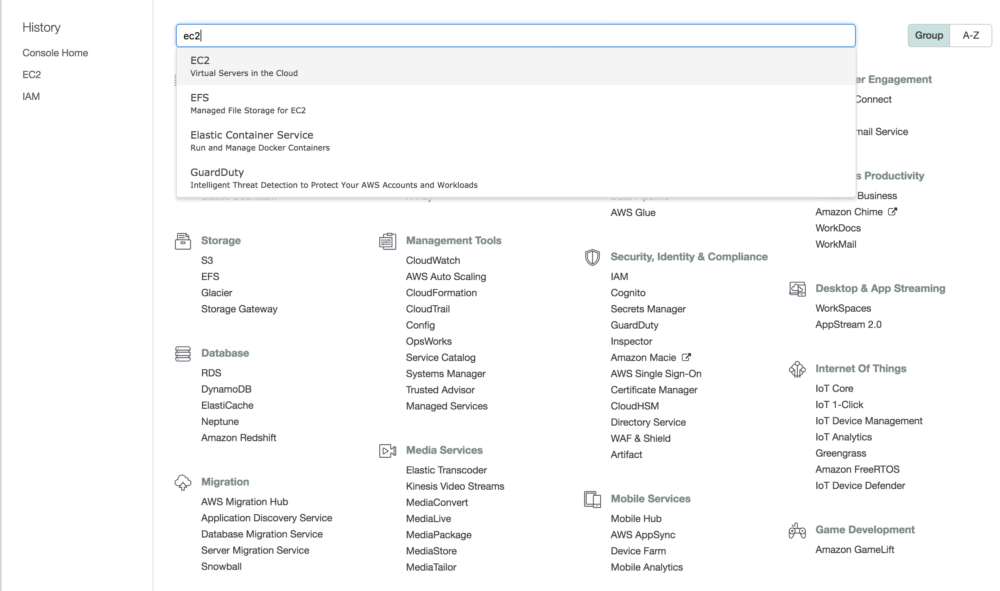
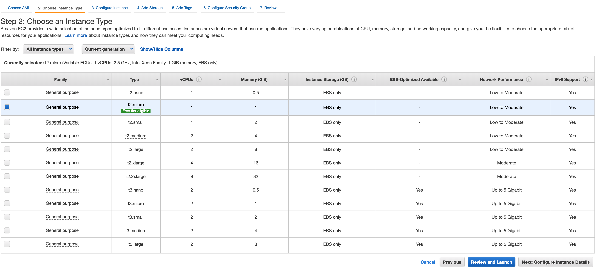
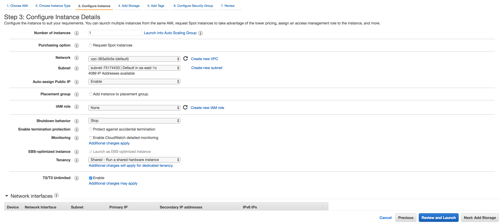

### [This tutorial is under development. Thank you for your patience]

# Introduction

This tutorial will show you how to set up the same infrastructure (called from now on *base infrastructure*) Slalom provided to the attendees during the event so they could build a solution for the challenge.

The steps in this tutorial will be targeted at Mac OS and Linux system. If you are using Windows, instructions will be provided but it will not be shown.

# The base infrastructure

The resources launched as part of the solution for the challenge **are not** considered base infrastructure. The base infrastructure on both AWS and Google Cloud (GCP) consists of instance images (API 1 on AWS and API 2 on GCP).

## AWS

Let's start with AWS first. [Log in to your AWS account if you have one. If you do have an account, create one](https://aws.amazon.com/).

### Launching an EC2 instance

Once you are logged in to the console, select the region you want to work on. In this tutorial, I'll be working on the `sa-east-1` (São Paulo) region, so beware of region-specific info like AMI IDs. Once you select your region, click on **EC2**:



Now click on **Launch Instance** and select the *Ubuntu Server 16.04 LTS (HVM), SSD Volume Type* AMI:


If your account is new (less than 12 months old) you're eligible for the free tier. In this case, choose **t2.micro**. If you are not eligible for free tier, choose **t3.nano** (it's the cheapest).



On the Configure Instance Details page, choose a VPC (it can be the default one), choose a public subnet, and enable **Auto-assign Public IP**. Then click on **Review and Launch**:



The storage size of 8 GB is more than enough. Click on **Next: Add Tags**. Add any tag you wish, then click on **Next: Configure Security Group**. Create a new security group. Give it a name, description, and select **My IP** under **Source** (the field should be filled in with your external IP address). Once you're done, click on **Review and Launch**:


Review everything and click on **Launch**. When asked about a key pair, if you haven't got one yet, create and download it:


Finally, click on **Launch Instances**. 

### Connecting to the instance

Before connecting to the instance, grab its Public IP:


[If you are a Windows user, please follow this tutorial to connect to the instance](https://docs.aws.amazon.com/AWSEC2/latest/UserGuide/putty.html).

For Linux and Mac users, open the Terminal and type in the following command to protect your newly created private key:

```
$ chmod 600 PRIVATE_KEY_PATH
```

Now, run the following command:

```
$ ssh -i PRIVATE_KEY_PATH ubuntu@IP_ADDRESS
Welcome to Ubuntu 16.04.5 LTS (GNU/Linux 4.4.0-1065-aws x86_64)

 * Documentation:  https://help.ubuntu.com
 * Management:     https://landscape.canonical.com
 * Support:        https://ubuntu.com/advantage

  Get cloud support with Ubuntu Advantage Cloud Guest:
    http://www.ubuntu.com/business/services/cloud

0 packages can be updated.
0 updates are security updates.


The programs included with the Ubuntu system are free software;
the exact distribution terms for each program are described in the
individual files in /usr/share/doc/*/copyright.

Ubuntu comes with ABSOLUTELY NO WARRANTY, to the extent permitted by
applicable law.

To run a command as administrator (user "root"), use "sudo <command>".
See "man sudo_root" for details.

ubuntu@ip-xxx-xx-xx-xxx:~$
```

### Configuring the system

Let's configure this server so we can later generate an AMI. First, clone this repository in Ubuntu's home directory:

```
$ git clone https://github.com/slalomdojo/terraform-challenge
Cloning into 'terraform-challenge'...
remote: Counting objects: 10, done.
remote: Compressing objects: 100% (10/10), done.
remote: Total 10 (delta 0), reused 10 (delta 0), pack-reused 0
Unpacking objects: 100% (10/10), done.
Checking connectivity... done.
```

[...]
