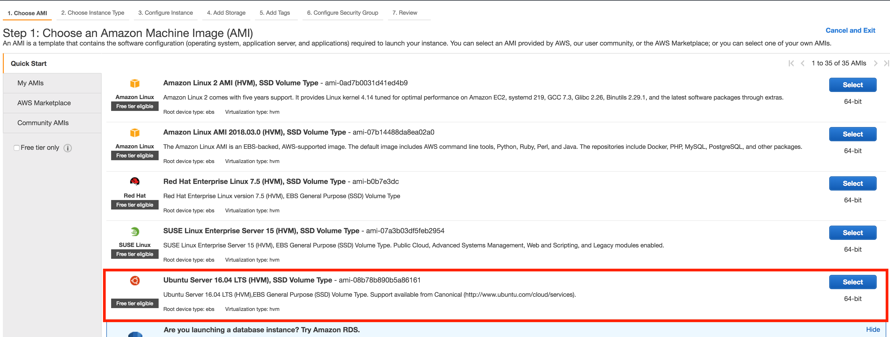
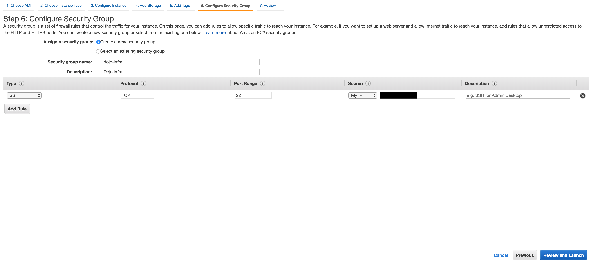

### [This tutorial is under development. Thank you for your patience]

# Introduction

This tutorial will show you how to set up the same infrastructure (called from now on *base infrastructure*) Slalom provided to the attendees during the event.

The steps in this tutorial will be targeted at Mac OS and Linux systems. However, if you are using Windows, external links will be provided with further instructions.

# The base infrastructure

The resources launched as part of the solution for the challenge **are not** considered base infrastructure. The base infrastructure on both AWS and Google Cloud (GCP) consists of an AMI on AWS for API 1 and an instance image on GCP for API 2.

# tl;dr

Here's a short summary of what you need to do to set up the base infrastructure. On both AWS and GCP, launch a Virtual Machine using Ubuntu as base image (you can choose other Linux distro if you want, but this tutorial will be for Ubuntu) and [install Node.js 8](https://github.com/nodesource/distributions). Copy the contents of the API 1 and API 2 folders to these machines (find the code for both APIs in the `apis` folder in this repository). Run `npm install` inside each api folder and then run `node index.js &`. Curl localhost (port 3000 for API 1 and port 5000 for API 2). If you get a response, you're in the right path.

Next step is to automate starting up these APIs during launch time. Create the following cronjob:

```
@reboot forever start --watch --watchDirectory /home/ubuntu/api-1/config/ /home/ubuntu/api-1/index.js
```

Replace the paths above accordingly. Note: both `--watch` and `--watchDirectory` are necessary for Stage 5.

Stop and start both Virtual Machines and check that the API starts automatically by curling localhost. If that happens, you're ready to go: create an image for API 1 and API 2 and use those IDs in your solution.

If you are still in doubt about the procedures above and do not know what to do, please keep reading as we'll do it step by step.

# Step By Step

## AWS

Let's start with AWS first. [Log in to your AWS account if you have one. If you do have an account, create one](https://aws.amazon.com/).

### Launching an EC2 instance

Once you are logged in to the console, select the region you want to work on. In this tutorial, I'll be working on the `sa-east-1` (São Paulo) region, so beware of region-specific info like AMI IDs. Once you select your region, click on **EC2**:


Now click on **Launch Instance** and select the *Ubuntu Server 16.04 LTS (HVM), SSD Volume Type* AMI:



If your account is new (less than 12 months old) you're eligible for the free tier. In this case, choose **t2.micro**. If you are not eligible for free tier, choose **t3.nano** (it's the cheapest).


On the Configure Instance Details page, choose a VPC (it can be the default one), choose a public subnet, and enable **Auto-assign Public IP**. Then click on **Review and Launch**:


The storage size of 8 GB is more than enough. Click on **Next: Add Tags**. Add any tag you wish, then click on **Next: Configure Security Group**. Create a new security group. Give it a name, description, and select **My IP** under **Source** (the field should be filled in with your external IP address). Once you're done, click on **Review and Launch**:



Review everything and click on **Launch**. When asked about a key pair, if you haven't got one yet, create and download it:


Finally, click on **Launch Instances**. 

### Connecting to the instance

Before connecting to the instance, grab its Public IP:


[If you are a Windows user, please follow this tutorial to connect to the instance](https://docs.aws.amazon.com/AWSEC2/latest/UserGuide/putty.html).

For Linux and Mac users, open the Terminal and type in the following command to protect your newly created private key:

```
$ chmod 600 PRIVATE_KEY_PATH
```

Now, run the following command:

```
$ ssh -i PRIVATE_KEY_PATH ubuntu@IP_ADDRESS
Welcome to Ubuntu 16.04.5 LTS (GNU/Linux 4.4.0-1065-aws x86_64)

 * Documentation:  https://help.ubuntu.com
 * Management:     https://landscape.canonical.com
 * Support:        https://ubuntu.com/advantage

  Get cloud support with Ubuntu Advantage Cloud Guest:
    http://www.ubuntu.com/business/services/cloud

0 packages can be updated.
0 updates are security updates.


The programs included with the Ubuntu system are free software;
the exact distribution terms for each program are described in the
individual files in /usr/share/doc/*/copyright.

Ubuntu comes with ABSOLUTELY NO WARRANTY, to the extent permitted by
applicable law.

To run a command as administrator (user "root"), use "sudo <command>".
See "man sudo_root" for details.

ubuntu@ip-xxx-xx-xx-xxx:~$
```

### Configuring the system

Let's configure this server so we can later generate an AMI. First, clone this repository in Ubuntu's home directory:

```
$ git clone https://github.com/slalomdojo/terraform-challenge
Cloning into 'terraform-challenge'...
remote: Counting objects: 10, done.
remote: Compressing objects: 100% (10/10), done.
remote: Total 10 (delta 0), reused 10 (delta 0), pack-reused 0
Unpacking objects: 100% (10/10), done.
Checking connectivity... done.
```

[...]
